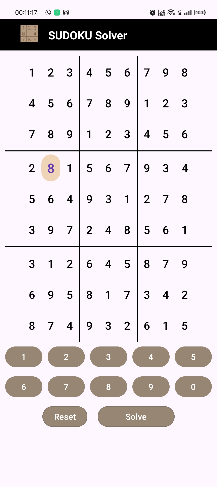

# Sudoku Solver App

The **Sudoku Solver App** is a sleek, efficient Android app designed to help users solve Sudoku puzzles. It comes with dynamic themes, real-time error handling, and an intuitive interface. Whether you are a Sudoku beginner or an enthusiast, this app simplifies puzzle-solving with its powerful backtracking algorithm.


## Table of Contents

- [Features](#features)
- [Screenshots](#screenshots)
- [Technologies Used](#technologies-used)
- [Installation](#installation)
- [Usage](#usage)
  - [Main Screen](#main-screen)
  - [Theme Support](#theme-support)
- [Code Structure](#code-structure)
- [Backtracking Algorithm](#backtracking-algorithm)
- [Error Handling](#error-handling)

- [Contributing](#contributing)
- [License](#license)
- [Author](#author)


## Features

- **Theme Support**: Supports both light and dark themes, offering a seamless user experience.
- **Error Handling**: Detects and notifies about invalid grid configurations like conflicting numbers.
- **Real-Time Puzzle Solver**: Solves the Sudoku puzzle instantly with the press of a button.
- **Dynamic Number Input**: Allows users to input numbers easily via on-screen buttons.
- **Grid Reset**: The grid can be reset to its default state for new puzzles.
- **Highlighting**: Highlights selected cells to ensure clarity when inputting numbers.

---

## Screenshots

Here are some visuals showcasing the app's features:

1. **Light Theme Main Screen**  
<p align="center">
  
  
</p>

2. **Dark Theme Main Screen**  
<p align="center">
  
  
</p>

---

## Technologies Used

- **Java**
- **Android SDK**
- **Android Studio**

---

## Installation

Follow these steps to install and run the Sudoku Solver App:

1. Clone this repository:  
   ```bash
   git clone https://github.com/Arnavjain2503/Sudoku-Sage.git
   ```

2. Open the project in **Android Studio**.

3. Connect your Android device or use an emulator.

4. Build and run the app on your device.

---

## Usage

### Main Screen

- Tap on any cell in the 9x9 grid to select it.
- Use the number buttons (1-9) below the grid to input digits.
- Press **Reset** to clear the grid and start fresh.
- Press **Submit** to solve the puzzle. If the grid is unsolvable or invalid, the app will display an error message.

### Theme Support

- The app automatically switches between **Light** and **Dark** modes depending on the system's theme settings. This improves user experience and reduces eye strain.

---

## Code Structure

### Key Components:

- **MainActivity.java**: This file contains the core logic for the app, including handling user input, solving the puzzle, and resetting the grid.
  
  Key Methods:
  - `handleSudokuDigits(Button clickedButton)`: Highlights selected buttons and inputs digits.
  - `resetGrid()`: Resets the Sudoku grid to the default state.
  - `solveSudoku()`: Utilizes a backtracking algorithm to solve the puzzle.
  - `validateInput()`: Checks the validity of the grid input and ensures there are no conflicting numbers.
  
  The algorithm efficiently fills the empty cells while checking for errors like duplicate numbers in the same row, column, or sub-grid.

---

## Backtracking Algorithm

The **backtracking algorithm** employed is a recursive method to fill the Sudoku grid while adhering to Sudoku rules. It tries numbers from 1 to 9 for each empty cell and backtracks when an invalid number is placed.

**How it works:**
1. Start with the first empty cell.
2. Try placing digits from 1-9.
3. Check for conflicts in the row, column, and 3x3 sub-grid.
4. If no conflict, move to the next cell.
5. If conflicts occur, backtrack to the previous cell and try a new number.

---

## Error Handling

The app is built to ensure no invalid Sudoku configuration is allowed:
- **Conflicting Rows/Columns**: Detects and prevents duplicate numbers in the same row or column.
- **Invalid Input**: Prompts the user with error messages for improper inputs.
- **Unsolvable Puzzle**: If the puzzle is unsolvable, the app notifies the user.

---


## Contributing

We welcome contributions to improve this app! Feel free to submit pull requests or raise issues for bugs, features, or enhancements.

---

## License

This project is licensed under the MIT License - see the [LICENSE](LICENSE) file for details.

---

## Author

Arnav Jain
